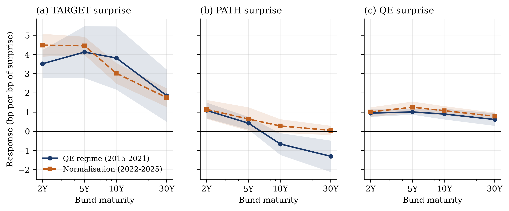

# The Rotation of the Curve

**Did ECB policy transmission to the German yield curve change when the euro area moved from balance sheet expansion to normalisation?**

It did, but not in the way the attenuation story predicts. Using intraday asset price changes around 83 Governing Council meetings from January 2015 to October 2025, I decompose each meeting into orthogonal *target*, *path* and *balance-sheet* surprises and test whether the curve response is constant across regimes.

**The balance-sheet channel is stable.** It moves Bund yields close to one for one at every maturity, in both regimes, with regime interactions that never approach significance.

**The long end is where things changed.** Before 2022 a hawkish path surprise *lowered* thirty-year Bund yields by 1.30 bp per bp. That response is now zero — a shift of 1.35 bp, wild-bootstrap *p* = 0.037. In parallel, target surprises acquired a slope effect they previously lacked, flattening 2s10s by 1.46 bp per bp against essentially zero before.

**And the evidence is stated at its actual strength.** Joint stability tests do not reject coefficient constancy in any equation, and no individual interaction survives a Holm correction across all 21 tests. What the paper documents is a coherent pattern of point estimates across maturities, shock classifications and robustness variants — not a statistically established break. The paper says so, prominently, rather than in a footnote.

The practical implication is that curve sensitivities calibrated on the QE period misstate today's reaction function, and the misstatement is concentrated in long-duration positions.



*Response of Bund yields to each policy surprise, by regime, with 90% confidence bands. The middle panel is the headline result.*

---

## Findings at a glance

| | QE regime (2015–21) | Normalisation (2022–25) | Bootstrap *p* |
|---|---|---|---|
| Path surprise → 30Y Bund | −1.30 (0.50) | +0.05 (0.15) | **0.037** |
| Path surprise → 10Y Bund | −0.66 (0.35) | +0.28 (0.22) | 0.064 |
| Target surprise → 2s10s slope | +0.30 (0.81) | −1.46 (0.28) | **0.033** |
| Balance-sheet surprise → 10Y Bund | +0.90 (0.17) | +1.08 (0.15) | 0.476 |
| Target surprise → IT–DE 10Y spread | +15.65 (5.01) | +2.05 | **0.033** |
| Share of information shocks | 46.4% | 14.8% | — |

Coefficients are basis points of yield change per basis point of surprise in each factor's anchor instrument. HC1 standard errors in parentheses.

## Method

- **Identification.** High-frequency event study in the tradition of Kuttner (2001), Gürkaynak, Sack and Swanson (2005) and Altavilla et al. (2019). The euro area separates the rate decision (press release) from the elaboration of outlook and balance sheet (press conference), which allows the surprise dimensions to be separated by construction.
- **Factors.** PCA per window, rotated by an orthonormal matrix parameterised as the exponential of a skew-symmetric matrix, subject to an exclusion restriction. Each factor is scaled so a one-unit realisation moves its anchor instrument by exactly 1 bp, which makes every coefficient directly readable.
- **Inference.** With only 27 post-liftoff meetings, asymptotic inference on the interaction terms over-rejects. All headline results carry restricted wild-bootstrap *p* values (Rademacher weights, 4,999 replications, null imposed).
- **Panel.** Four-country, three-maturity panel with unit fixed effects and date-clustered standard errors for the fragmentation test.

## What this project does *not* claim

Two hypotheses fixed before estimation were **rejected** and are reported as such: that the balance-sheet channel would attenuate under runoff (H2), and that fragmentation would be a balance-sheet rather than a rate phenomenon (H5).

No trading strategy is back-tested. With 83 events, any Sharpe ratio from event-window returns would be sampling noise. The portfolio section reports a scenario calibration sized at one within-regime standard deviation, explicitly in-sample.

One specification moves the ten-year result: extracting three rather than two press-conference components attenuates the path interaction from 0.94 to 0.34. This is reported in the robustness section rather than buried. And the joint stability tests that fail to reject are a numbered table in the main text, not an appendix.

## Data

[Euro Area Monetary Policy Event-Study Database](https://www.ecb.europa.eu/pub/pdf/annex/Dataset_EA-MPD.xlsx) (Altavilla, Brugnolini, Gürkaynak, Motto and Ragusa, *JME* 2019), maintained by the ECB. Free, no licence required.

> **A cleaning note worth reading before you use this dataset.** The workbook stores event dates as native dates for early rows and as `dd/mm/yyyy` **text** for later ones. Month-first parsers silently transpose day and month whenever both are below 13. In the current vintage this corrupts six dates — every one of them in 2024–25, i.e. entirely inside the regime under study. Each lands on a Sunday, Monday or Tuesday, though every meeting in the sample is a Wednesday or Thursday. `src/data_io.py` parses by cell type and asserts the weekday distribution.

## Reproduction

```bash
pip install -r requirements.txt
curl -o data/raw/Dataset_EA-MPD.xlsx https://www.ecb.europa.eu/pub/pdf/annex/Dataset_EA-MPD.xlsx
python run_all.py
```

Runs in under a minute and regenerates every table and figure in the paper. To build the PDF:

```bash
cd paper && pdflatex paper && bibtex paper && pdflatex paper && pdflatex paper
```

## Repository

```
src/config.py        every sample, regime and identification choice in one place
src/data_io.py       loading, date repair, regime assignment
src/factors.py       PCA and constrained orthogonal rotation
src/outcomes.py      dependent variables and curve summary statistics
src/shocks.py        policy vs information shock classification
src/regressions.py   OLS, regime interactions, wild bootstrap, rolling, panel
src/scenarios.py     response matrix and portfolio arithmetic
src/figures.py       the five publication figures
run_all.py           one command reproduces everything
paper/paper.tex      the full paper
```

## Paper

[`paper/paper.pdf`](paper/paper.pdf) — 15 pages including appendix.

## Licence

MIT for the code. The EA-MPD data are the property of the ECB and subject to its terms of use.
